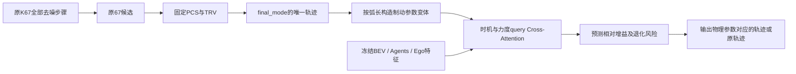

# 3.1.05_4：选后时机修正 PTR（Post-selection Timing Refiner）

日期：2026-09-12。实现者命名，不是已有论文的模块名称。

## 问题、判断与边界

原始 K67 + PCS + TRV 的 navtest PDMS 为 89.1819。上一版在生成器每层注入
时机注意力，epoch=12 为 89.1252，last 为 89.0861；保留为负向结果。
本版加载原始 K67、2026.09.07 的 PCS epoch=05、2026.09.09 的 TRV epoch=02。
旧注意力代码仍作为历史文件留在仓库，但新入口不安装它、不加载其权重。

选择后再进行一次纵向时机修正，比较基准为**选后原轨迹**，不是 GT、base 或 PCS 单独输出。
当前实现是**离散控制参数的修正器**：Cross-Attention 判断 24 组制动参数与恒等动作，
输出所选参数确定的新轨迹，不是直接回归自由 XY 坐标；也不改变原67候选的选取。
这样每个可输出动作都有直接的官方 PDM 监督，避免评分只对应离散标签、部署却输出未评分的混合轨迹。

### 为什么没有 N 层与 Bellman 折扣

`gamma^(N-i)` 是启发式层权重，不是 Bellman backup。Bellman 需要奖励、状态转移和后继价值；
原论文 diffusion timestep 是噪声步骤，不是环境时间。参考
[Spinning Up: Bellman equations](https://spinningup.openai.com/en/latest/spinningup/rl_intro.html)。
如果重入原生成器N层，就重新改变全部候选和原筛选分布，偏离本实验。
如果在选后反复修正，就必须重新标注每个中间状态，监督和累计偏移均更复杂。
同一场景重复N次不会增加独立样本数量，因此采用用户允许的单次方案。
单次前向每个训练epoch仍会遍历全部训练场景，不等于只进行一次梯度更新。

### 上一份局部 Oracle 的纠正

95.4096 是已有候选中按**同一时刻的平均ego-y差和航向差**筛出的 Oracle。
它不是严格固定路径，也不限纵向距离；弯道时同一路径重定时也可能被该条件排除。
不能把它当作纯制动修正上限，不能声称有6.23分可实现提升。
changed_scenes 大于 improved_scenes 还包含 argmax 等分换选，不都是有效修改。
新 cache 的 controlled Oracle 才基于下述受控动作空间。

## 网络插入位置与结构

论文图(a)接在轨迹集合后的 PCS/TRV Selection 之后；图(b)在完整蓝色去噪循环之外。
Q：未来0.5–4秒，以及每个动作的制动开始时刻、附加减速度、渐进时间。
Q 同时接收动作轨迹的时刻特征与沿轨迹采样的BEV。
K/V：原选中轨迹的8个时刻token + agents + ego特征。
单次 MultiheadAttention，宽度128、4头、无attention dropout。
物理尺度固定：位置60/30m、速度30m/s、加速度6m/s²、时间4s、附加减速度2m/s²。
新增网络没有梯度流向 K67/PCS/TRV。

## 动作空间及监督

- 恒等动作索引0，直接返回原float32轨迹，不重采样，不修改航向。
- 起点：0、0.5、1.0、1.5秒。
- 附加减速度：0.25、0.75、1.5 m/s²。
- 达到目标附加减速度的渐进时间：0.5、1.0秒。
- 24种组合，在原XY折线上以弧长重采样，50ms积分，按0.5秒输出8个姿态。
- 不加速、不延伸路径、不反向；这里只约束参考轨迹，**不保证实际模拟车辆不偏离路径**。
- 停车重复点作去重处理；原轨迹为全零时全部变体恒等。
- 每个动作通过既有 `score_candidates` 调用官方模拟与评分。每个worker分片首场景做独立官方一致性检查；
  每场景动作0还必须与原候选缓存PDM一致，否则中止。

教师：在 NC、DAC、TTC、comfort、direction 都不低于原选中轨迹的动作中选最大PDMS；
必须增益>1e-6，无增益和等分均恒等。不是用完美教师在部署时决策。
训练损失：所有25动作的相对PDM回归 + 退化风险BCE + 优势排序CE。
有害动作与大幅损益增加权重，保留无改进场景；专家未来轨迹不作为网络输入。
这里使用完整PDM增益作离线监督，**不是强化学习，也不是Bellman价值迭代**。

部署：先固定原final_mode，再预测动作增益/退化风险，判断严格正增益与风险阈值。
动作0始终可用。输出head零初始化，未训练时增益全0，必定恒等。
增益/风险门限只在原navtrain val日志上校准；使用全量、去重的DDP验证结果。
候选门限网格固定在代码内，选择平均PDMS提升且平均NC/DAC/TTC/comfort/direction不降低的策略。
若都不优于恒等，checkpoint存 `enabled=false`，评估保持原方案。
**预测门控和验证平均约束不是逐场景安全保证**；结果必须报告有害编辑次数和全部安全项。

## 数据与缓存

| 已有数据 | 用途 |
|---|---|
| pcs_candidates_k67_3_1_05（205G） | 原冻结上下文与原候选，cache与训练都需要 |
| metric_cache_navtrain_pcs_3_1_05 | 官方train/val动作标签；如果删除，必须恢复/重新生成 |
| metric_cache | navtest最终配对评分 |
| K67/PCS/TRV原checkpoint | 原决策链及身份验证 |

本版不需要94G原始feature cache、GTRS文件、旧timing输入sidecar、旧时机GT target。
新 `post_selection_timing_3_1_05_4/edit_cache` 只保存选中轨迹、模式索引、25动作评分，
128场景一block，完成的block可续用；断开的未完成block重算。
不会复制205G上下文。存储实际大小由pilot测量，约百MB量级，非精确承诺。
单进程读取原候选，评分进程最多保留2×worker任务；worker不传torch tensor以避免累计共享内存句柄。
训练默认WORKERS=0避免上版DataLoader共享tensor句柄问题。
代码与checkpoint与cache身份不匹配会中止，不绕过任何校验。

navtest Oracle只作为最终诊断，不用于生成训练样本、风险阈值或选择checkpoint。
新动作空间只覆盖附加减速，不能回答“加速通过路口是否更好”，也不涵盖所有可能的时机修正。

## 执行顺序

见 `server_3_1_05_4.md`：check → test → prepare-pilot → smoke → smoke-ddp → prepare → diagnose → train → eval-smoke → eval。
先检查真实controlled Oracle能否改善，不能仅依据95.41就预期成功。
训练默认20轮、每卡32、4卡共128、FP32、AdamW 1e-4。
checkpoint按val PDMS挑选，校准为恒等意味着没有验证收益，不允许以训练损失替代该事实。

## 验证记录

未在本地运行测试、语法或Smoke（按实验workflow要求），待服务器执行。
新增测试覆盖恒等、弯曲路径、停止重复点、制动参数效应、无反向延伸、退化保护教师、
梯度传播到Cross-Attention、非有限预测回退与验证恒等策略。
尚无本版训练结果，任何收益数字均待服务器实验。
